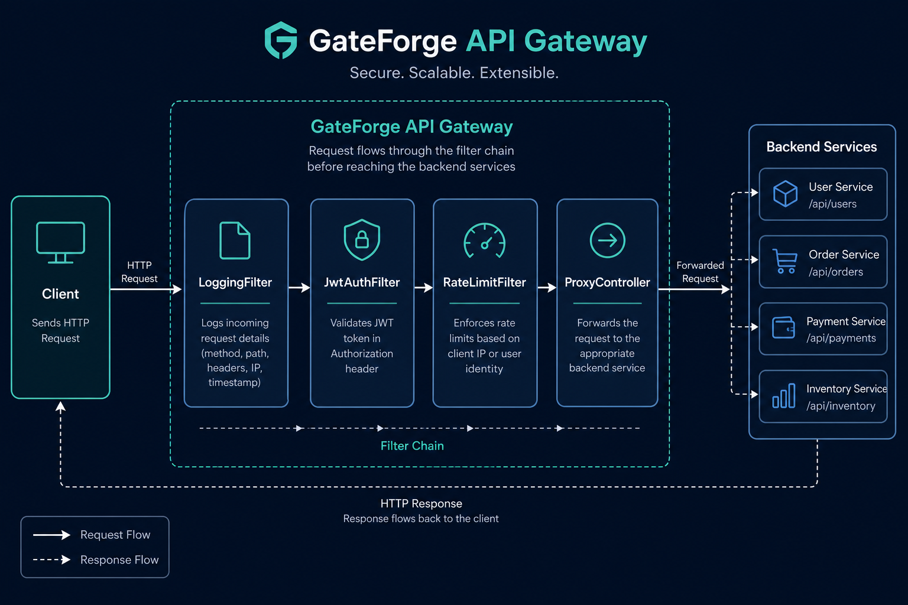

# GateForge – Lightweight API Gateway

Java 21 | Spring Boot 4.1 | Reverse Proxy | JWT | Rate Limiting | Middleware

GateForge is a learning-focused API Gateway built from scratch to understand how real gateways (Nginx, Kong, Envoy, Spring Cloud Gateway) work — without hiding logic behind heavy frameworks.

This is **not production-ready**. It is intentionally simplified to expose every mechanism clearly for study and interview preparation.

---

## Architecture



Every request passes through a Servlet Filter chain before reaching any controller:

```
Client
  │
  ▼
LoggingFilter        (@Order 1)  — logs method, path, status, latency
  │
  ▼
JwtAuthFilter        (@Order 2)  — validates Bearer JWT (public paths exempt)
  │
  ▼
RateLimitFilter      (@Order 3)  — 5 req / 10 sec per authenticated user
  │
  ▼
Controller
  ├─ /health, /health/ready  → HealthController
  ├─ /login                  → AuthController (issues JWT)
  └─ /api/**                 → ProxyController (forwards to backend)
  │
  ▼
Backend Service (e.g. user-service on :9001)
```

**Public paths** (no auth, no rate limit): `/health`, `/health/ready`, `/login`

---

## Features

| Feature | Details |
|---------|---------|
| Reverse Proxy | Forwards method, headers, body, and query string to configured backends |
| JWT Authentication | HS256 tokens, 60-minute expiry, secret from config/env |
| Rate Limiting | Configurable fixed-window limit (default: 5 req / 10 sec per user) |
| Logging | Every request logged with status and latency — including rejections |
| Health | `/health` (liveness) and `/health/ready` (backend readiness) |
| Config-driven routing | YAML routes with longest-prefix-match |
| Timeouts | 2s connect, 5s response — returns 504 on backend failure |

---

## Verified Test Results

> Run date: **2026-08-12** | Environment: **Windows 11, Java 21.0.11, Spring Boot 4.1.0**

### Automated tests — `mvn test`

```
Tests run: 18, Failures: 0, Errors: 0, Skipped: 0
BUILD SUCCESS
Total time: 43.008 s
```

| Test Class | Tests | Time | What it verifies |
|------------|-------|------|------------------|
| `GateforgeApplicationTests` | 1 | 9.5s | Spring context loads |
| `GatewayFilterIntegrationTest` | 6 | 6.3s | Health, login, auth 401/504 |
| `JwtUtilTest` | 2 | 0.07s | Token sign + validate |
| `ProxyIntegrationTest` | 3 | 7.1s | Header/body/query forwarding (WireMock) |
| `RateLimiterTest` | 2 | 0.04s | Fixed-window limit logic |
| `RateLimitIntegrationTest` | 1 | 2.1s | HTTP 429 after 3 configured requests |
| `RouteResolverTest` | 3 | 0.04s | Match, no-match, longest-prefix |

Full output: [`docs/test-results/unit-tests.txt`](docs/test-results/unit-tests.txt)

### Manual API tests — live server on `:8080`

Full output: [`docs/test-results/manual-api-tests.txt`](docs/test-results/manual-api-tests.txt)

| # | Request | Expected | Actual | Notes |
|---|---------|----------|--------|-------|
| 1 | `GET /health` | 200 | **200** | `{"status":"UP","service":"GateForge"}` |
| 2 | `GET /health/ready` | 200 | **200** | Status `DEGRADED` — all 3 backends down (expected without mock services) |
| 3 | `GET /login?username=rahul` | 200 + JWT | **200** | Token length: **131 chars**, latency: **211 ms** |
| 4 | `GET /api/users/5` (no token) | 401 | **401** | `Missing or invalid Authorization header` |
| 5 | `GET /api/users/5` (with JWT) | 504 | **504** | Backend unreachable, timeout ~92 ms |
| 6 | 6× `GET /api/users/1` (same JWT) | 5×504 then 429 | **4×504, 2×429** | Rate limit enforced (prior requests counted toward window) |

### Integration test log excerpts (real)

```
LoggingFilter : GET /login -> 200 (10 ms)
LoggingFilter : GET /api/users/5 -> 200 (667 ms)     ← proxy forwarded to WireMock
LoggingFilter : POST /api/users -> 200 (148 ms)      ← body forwarding works
LoggingFilter : GET /api/users/1 -> 429 (4 ms)       ← rate limit triggered
```

---

## Configuration

`gateforge/src/main/resources/application.yml`:

```yaml
server:
  port: 8080

gateforge:
  jwt:
    secret: ${JWT_SECRET:this-is-a-32-byte-minimum-secret-key-for-hs256!}
    expiration-minutes: 60
  rate-limit:
    max-requests: 5
    window-seconds: 10
  routes:
    - id: user-service
      path-prefix: /api/users
      target-url: http://localhost:9001
    - id: order-service
      path-prefix: /api/orders
      target-url: http://localhost:9002
    - id: payment-service
      path-prefix: /api/payments
      target-url: http://localhost:9003
```

### Adding a new route

```yaml
- id: notification-service
  path-prefix: /api/notifications
  target-url: http://localhost:9004
```

Restart GateForge. No Java code changes needed.

---

## Running Locally

### 1. Run all tests

```powershell
cd gateforge
.\mvnw.cmd test
```

Expected: **18 tests, 0 failures**, ~43 seconds.

### 2. Start the gateway

```powershell
.\mvnw.cmd spring-boot:run
```

### 3. Get a JWT

```powershell
# PowerShell
Invoke-RestMethod -Uri "http://localhost:8080/login?username=rahul"
```

```bash
# curl (Git Bash / WSL)
curl "http://localhost:8080/login?username=rahul"
```

### 4. Call a proxied route

```powershell
$token = Invoke-RestMethod -Uri "http://localhost:8080/login?username=rahul"
Invoke-WebRequest -Uri "http://localhost:8080/api/users/5" `
  -Headers @{ Authorization = "Bearer $token" } -UseBasicParsing
```

Without a backend running on `:9001`, expect **504 Gateway Timeout**.

### 5. Test with a mock backend (WireMock-style)

Start any HTTP server on port 9001:

```powershell
python -m http.server 9001
```

Then repeat step 4 — you should get a **200** relayed from the backend.

### 6. Health checks

```powershell
Invoke-RestMethod -Uri "http://localhost:8080/health"
Invoke-RestMethod -Uri "http://localhost:8080/health/ready"
```

---

## Tech Stack

| Component | Version |
|-----------|---------|
| Java | 21 |
| Spring Boot | 4.1.0 |
| JWT | jjwt 0.12.6 (HS256) |
| HTTP Client | Apache HttpClient 5 |
| Test (mock backend) | WireMock 3.9.1 |
| Build | Maven |

---

## Project Layout

```
gateforge/
├── src/main/java/com/gateforge/
│   ├── auth/           JwtAuthFilter, JwtUtil, AuthController
│   ├── config/         HttpClientConfig, PublicPaths
│   ├── health/         HealthController (/health, /health/ready)
│   ├── logging/        LoggingFilter
│   ├── proxy/          ProxyController
│   ├── ratelimit/      RateLimitFilter, RateLimiter
│   └── routing/        RouteResolver, GatewayProperties
├── src/test/java/      18 automated tests
└── src/main/resources/application.yml
docs/
├── images/             Architecture diagram
└── test-results/       Captured test output
decision.md             Architecture & decision record
```

---

## Known Limitations (Intentional)

- Rate limiter is **in-memory** — not shared across replicas (production: Redis)
- **Fixed window** algorithm — boundary burst edge case (production: sliding window / token bucket)
- No circuit breaker or retry on backend calls
- No TLS termination
- `/login` is a dev-only token mint — not a real authentication flow

See [`decision.md`](decision.md) for full architecture decisions, tradeoffs, and evolution history.

---

## What Was Fixed (Aug 2026)

| Issue | Fix |
|-------|-----|
| `/login` returned 401 | Added to public paths in `PublicPaths` |
| Proxy dropped headers/body/query | Full forwarding in `ProxyController` |
| Hardcoded rate limit | Configurable via `application.yml` |
| Hardcoded JWT secret | Externalized via `JWT_SECRET` env var |
| No readiness probe | Added `/health/ready` with backend checks |
| No integration tests | Added 10 integration tests with WireMock |
| README said Java 17 | Corrected to Java 21 |
